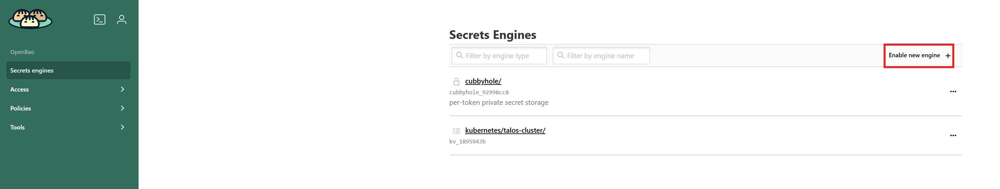
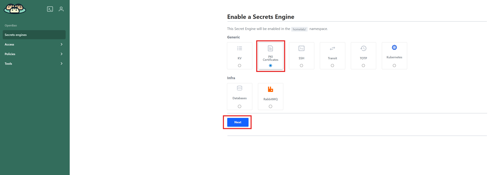
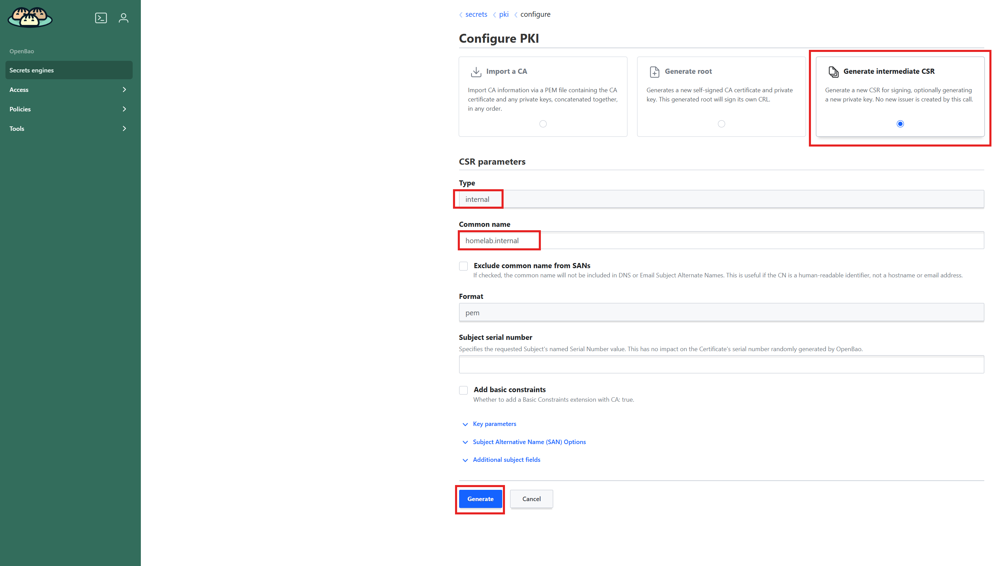
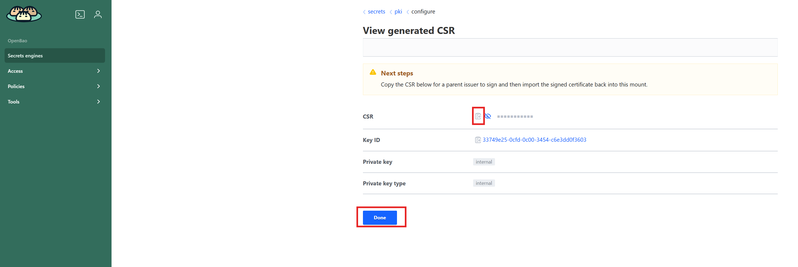
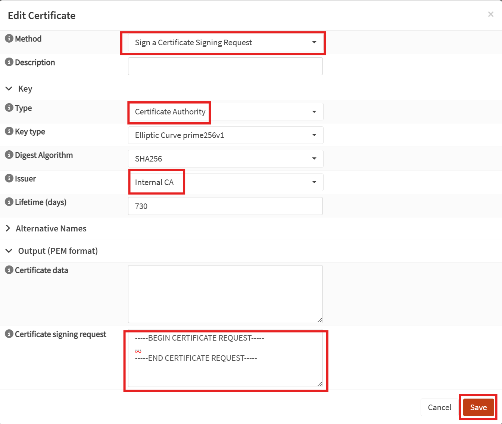
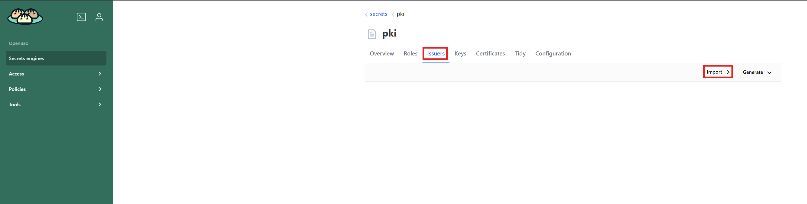
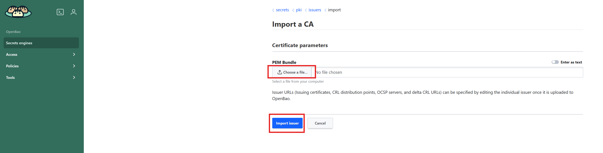

# Setting an Intermediate Certificate Authority on Openbao

## Enable a PKI engine and Create a Certificate Signing Request (CSR)

Connect to your Openbao instance and click on "Enable new engine": 

Select the PKI Certificate Engine, click "Next" and "Enable engine":

Click on "Configure PKI", select "Generate intermediate CSR" and fill out the fields:

Copy the CSR content:

## Sign an intermediate CSR in OPNsense

Log in into OPNsense and go to "System" > "Trust" > "Certificates".

Then click the "[+]" (add) button and fill out the fields as follow:

Once created, download the generated certificate.

## Create the Issuer in Openbao

Go back to Openbao in your PKI engine and within the "Issuer" tab, click on "Import":

Finally, upload the previously generated certificate and click on "Import Issuer":

The Issuer should show up and its "Default key ID" correspond to the one generated by the Certificate Signing Request.
