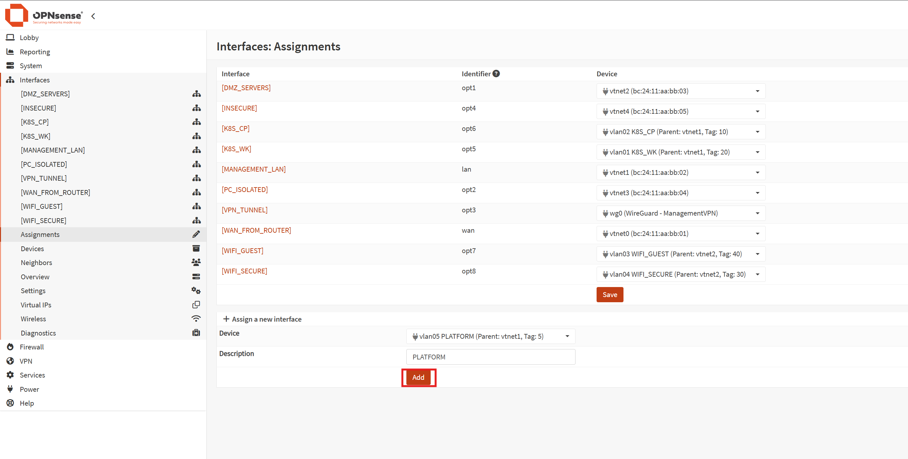
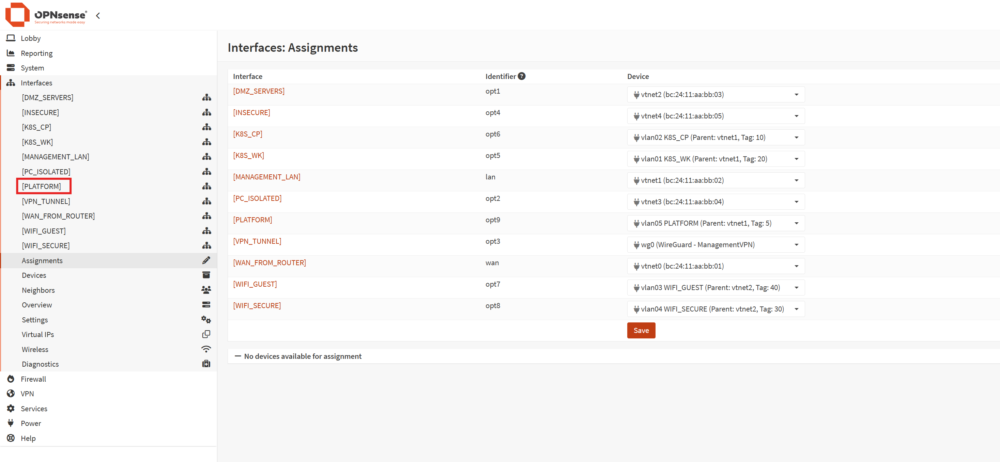
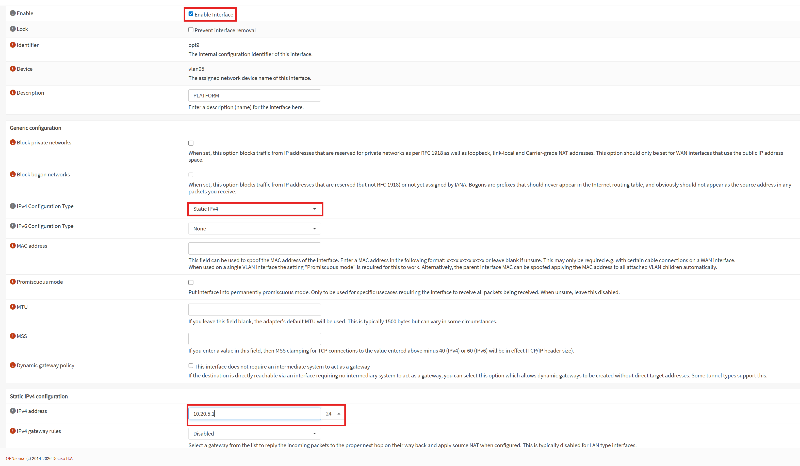

# Add A VLAN to OPNsense

## Add the Proxmox VLAN interface

Proxmox VLAN Interface creation and attachement to OPNsense VM is done through Infrastructure As Code

To apply the platform project you must set the following environment variables:
```bash
PROXMOX_VE_ENDPOINT=
PROXMOX_VE_API_TOKEN=

OPNSENSE_URI=
OPNSENSE_API_KEY=
OPNSENSE_API_SECRET=
```

In the `iac/opentofu/opnsense-init/main.tf` file, add the VLAN in the `linux_vlans` map.

Apply the update:
```bash
tofu apply
```

Then go into the OPNsense UI and add the new VLAN to the assignment:



Go into the new interface configuration page:



Configure the interface:

