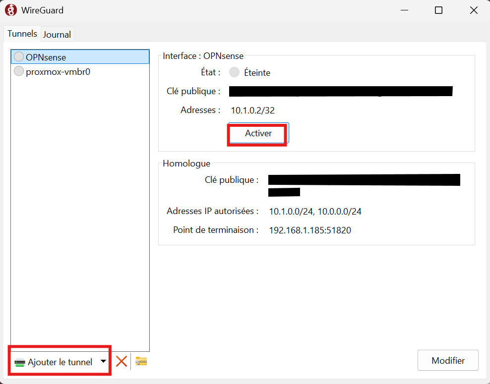

# Create an OPNsense Golden Image template

## Prepare the initial OPNsense config

Create and update the `config.xml` in the `iac/packer` folder.

See [iac/packer/config.xml](/iac/packer/config.xml) for an example that automate the assignment of interfaces

Update the `opnsense.auto.pkvars.hcl` with your values
```
proxmox_node     = "<NODE-NAME>"
opnsense_version = "<VERSION>"
```

Finally build the template:
```
packer build .
```

It took me around ~8min to build my template. Your mileage may vary.

> [!TIP]
> If the script blocks, it may mean that the wait values used aren't adapted to your setup so you may increase wait times for involuntarily skipped steps.
>
> To debug issues, run the template with the `-on-error=ask` flag:
> ```
> packer build -on-error=ask .
> ```

## Enable WireGuard VPN (Optional)

Install WireGuard (https://www.wireguard.com/install/). I personally install it both on windows and my wsl terminal
```bash
sudo apt -y update \
    && sudo apt -y install wireguard
```

Once installed generate two key wireguard key pairs:
- Server keys (OPNsense):
```bash
wg genkey | tee server_private.key | wg pubkey > server_public.key
```
- Client Keys:
```bash
wg genkey | tee client_private.key | wg pubkey > client_public.key
```

Create a file named `secrets.pkrvars.hcl`. This file is in the `.gitignore` so it won't be push.
```
# WireGuard Server Keys (The OPNsense side)
wg_privkey          = "<content-of-server_private.key>"
wg_pubkey           = "<content-of-server_public.key>"

# WireGuard Client Keys
wg_client_pubkey    = "<content-of-client_public.key>"
```

Put this file at the root path of where you're running the `packer build` command

Run the command to create the image with automation of assignment and creating a WireGuard instance:
```bash
packer build -var-file="secrets.pkrvars.hcl" .
```

Then in your WireGuard configuration add the following file `wireguard-opnsense.conf`
```toml
[Interface]
PrivateKey = "<content-of-client_private.key>"
Address = 10.1.0.2/32
DNS = 10.0.0.1

[Peer]
PublicKey = "<content-of-server_public.key>"
AllowedIPs = 10.1.0.0/24, 10.0.0.0/24
Endpoint = <WAN-IP>:51820
```

On Windows import the file and activate it



On Linux move the file into the `/etc/wireguard` directory and then:
```bash
wg-quick up /etc/wireguard/wireguard-opnsense.conf
```

## Create an OpenTofu user and generate an API Key (optional)

Add the following into the `secrets.pkrvars.hcl` file:
```bash
# OPNsense API Credentials for OpenTofu
opnsense_api_key    = "your_api_key"
opnsense_api_secret = "your_api_secret"
```

Finally build the image:
```bash
packer build -var-file="secrets.pkrvars.hcl" .
```