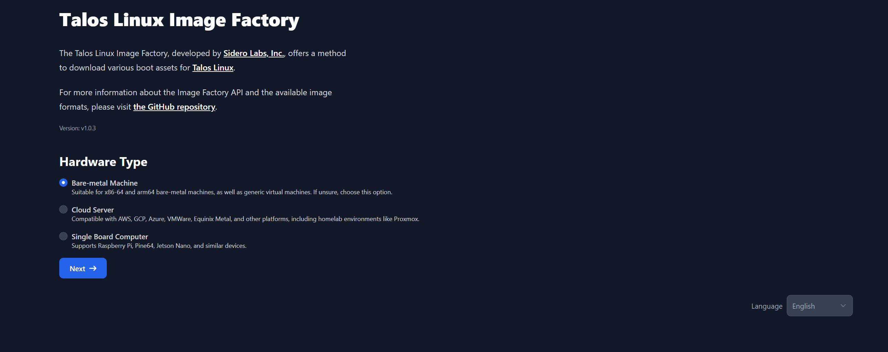
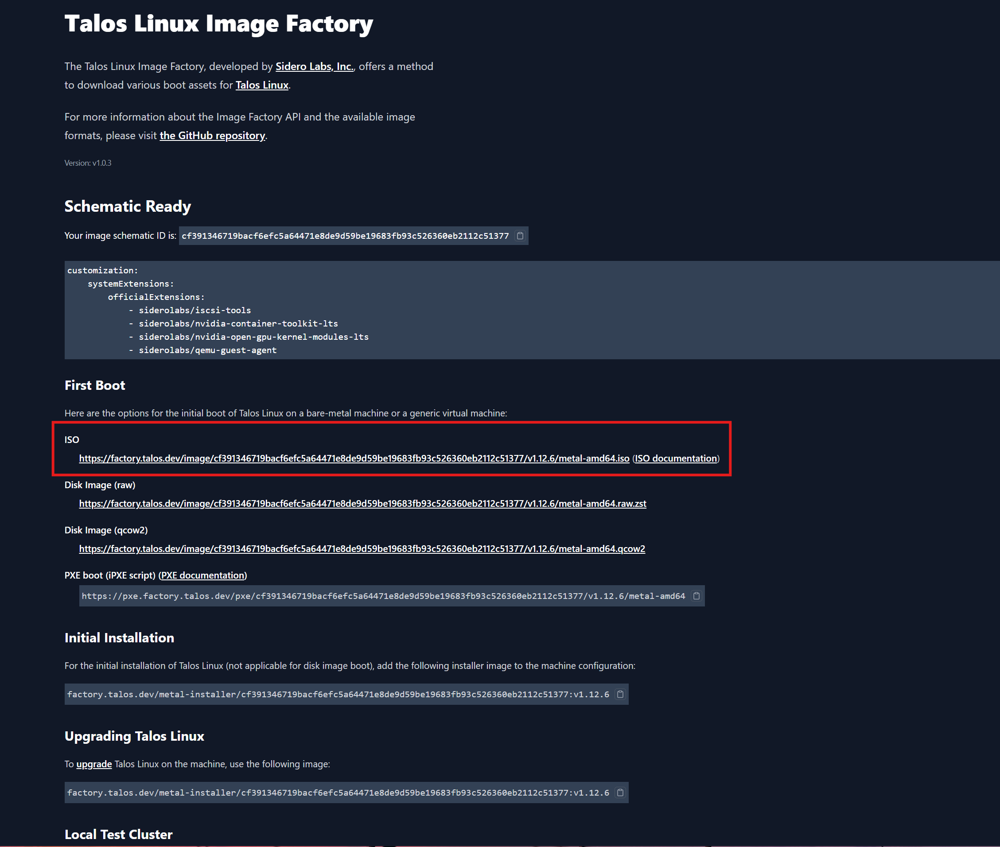
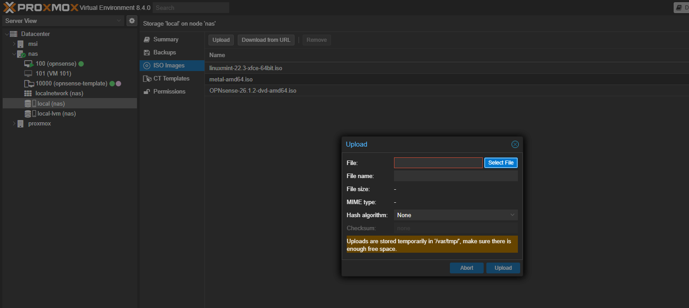

# Generate Talos ISO Image

## What's Talos ?

Talos is an operating system which main purpose is to act as Kubernetes nodes and simplify clustering.

The big pro to Talos is that once installed, its fully configurable through API.

## Download the Talos ISO Image
Go over the https://factory.talos.dev/ website and begin the process.

For Proxmox-based VM, select Bare-metal Machine for the Hardware Type:

Choose the latest available version of Talos.

For the Machine Architecture, choose based on your CPU (e.g. in my case amd64)

In System Extensions, here are the one I check and why:
* *siderolabs/qemu-guest-agent*: install qemu agent in the node to allow proxmox to retrieve metadatas (e.g. IPs, etc.)
* *siderolabs/iscsi-tools*: allow support of RWX access mode for PVC
* *siderolabs/nvidia-container-toolkit-lts*: allows containerd to pass the GPU through to Kubernetes pods
* *siderolabs/nvidia-open-gpu-kernel-modules-lts*: contains nvidia GPU drivers

For Customization, nothing to add, make sure to keep bootloader as 'auto'

Download the ISO:

Upload the ISO over Proxmox:
