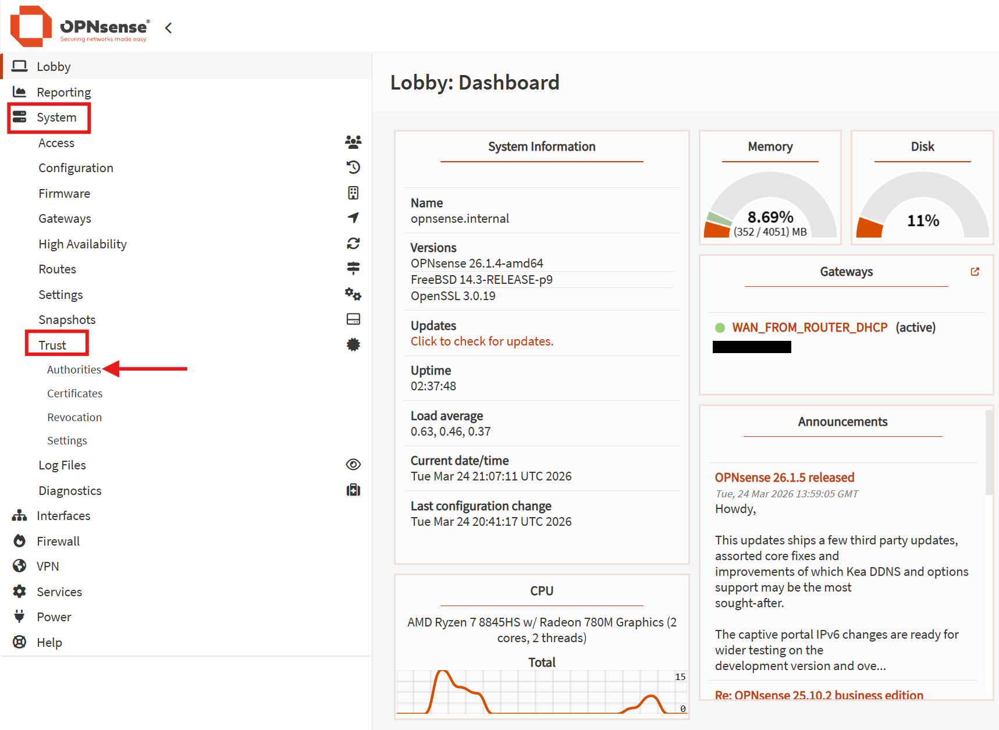
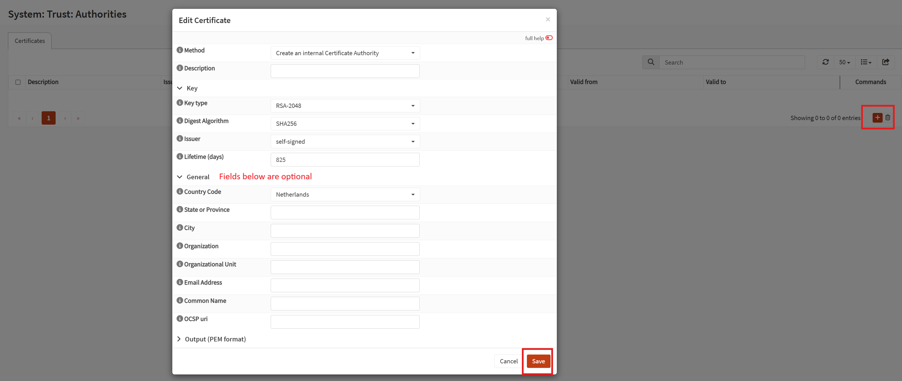
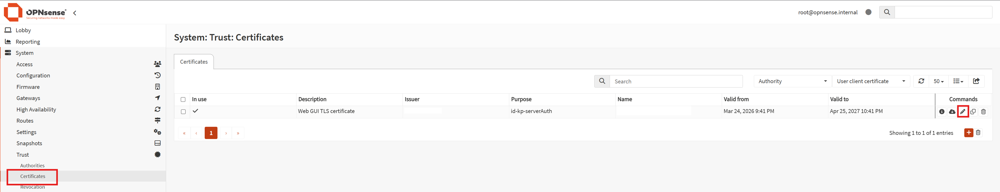
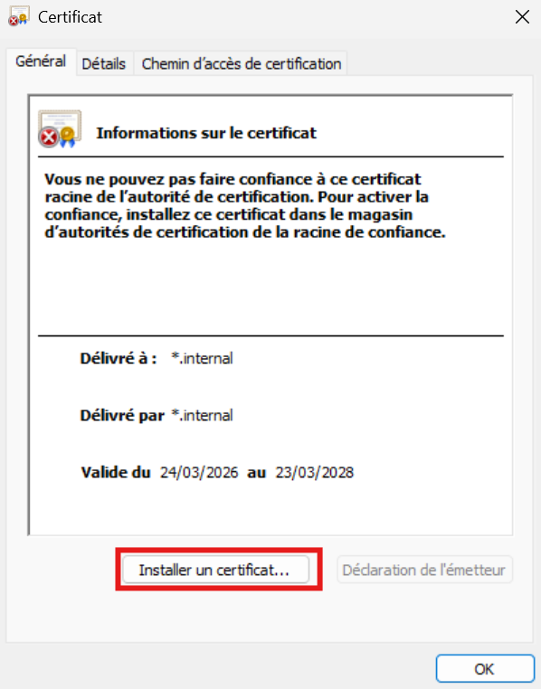
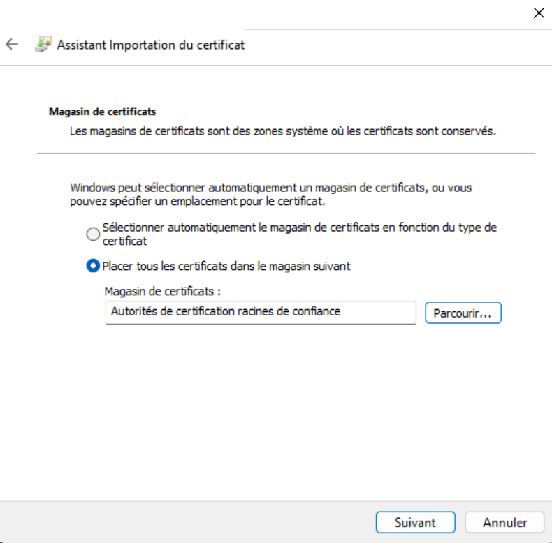
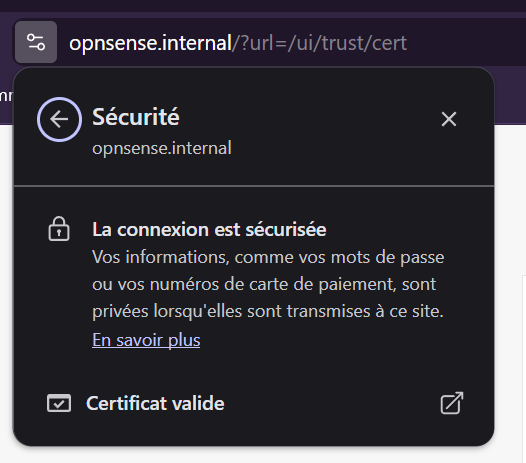
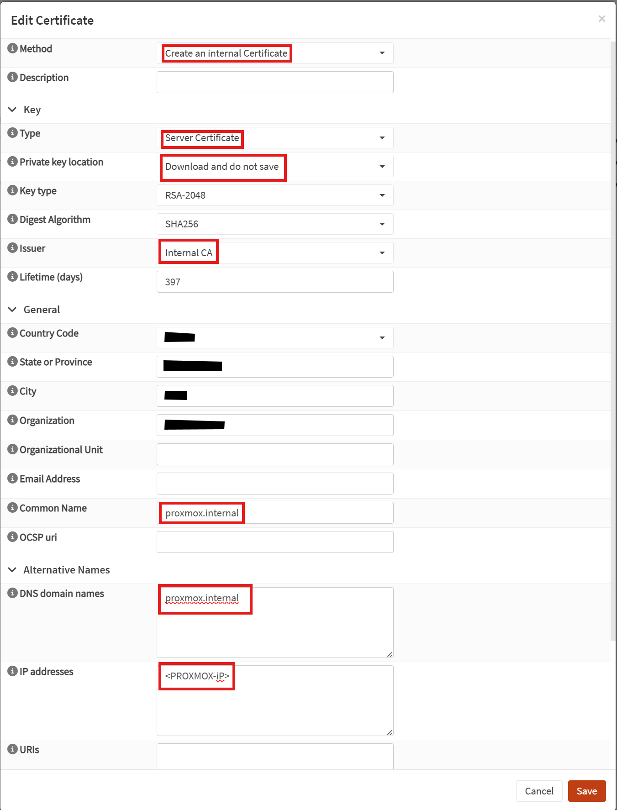
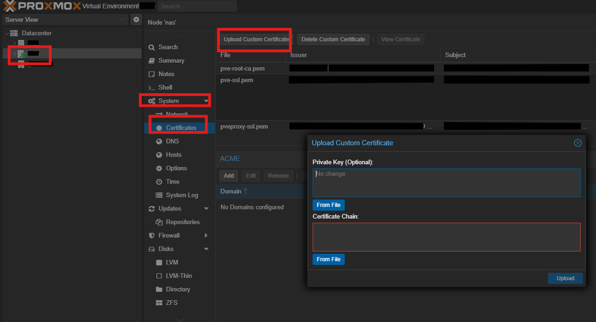

# OPNsense Internal Certificate Authority

## Why Internal CA over Public CA ?

Since most usage would be private there is no real need for Public CA.

Using Internal CA comes with the advantage of being able to use private TLD (e.g., `.internal`)

And lastly, certificates generated with a public CA are logged and viewable by anyone (crt.sh), which basically provide information of services you might be running.

## Create and use OPNsense Internal Certificate Authority

Log in to your OPNsense administrator UI.

In the toggle menu at the right side, select "System" > "Trust" > "Authorities"



Then click on the "[+]" (add) button and fill out the fields, I recommend to not skip all "General" fields even though they're optional.



Next we'll update the OPNsense administrator UI certificate.

Go to "System" > "Trust" > "Certificates".

Click on the "Pen" symbol next to the existing Web GUI certificate and update it to use our internal CA as issuer.



To verify that its working, you must go back to the "Authorities" page and download the certificate and install it on your local computer.

## Install the CA on Windows

[On Windows](https://learn.microsoft.com/en-us/skype-sdk/sdn/articles/installing-the-trusted-root-certificate), once you downloaded update the Certificate Authority certificate, make sure its extension is ".crt" (if its ".pem" you can rename it) and double click on it.

Select "Install Certificate" > "Next" > "Local Computer" (need admin privileges) > "Next"



Then click  "Place all certificates in the following store" and choose "Trusted Root Certification Authorities store" and hit "Next" and finish the process



Open an incognito page using your opnsense domain and you'll see that the connection is secured !



## Generate a server certificate

Now that we have an internal CA we can generate certificate for servers and applications.

Let's take the example of adding a custom certificate for proxmox.

First, in your opnsense GUI, go to "System" > "Trust" > "Certificates".

Click on the [+] (add) button to create a new certificate.

Expand "Alternative Names" and fill out the form with:
- The "Method" as "Create an internal Certificate"
- The "Issuer" as your opnsense issuer name (e.g., "Internal CA")
- (optional) For "Key type", use "Download and do not save"
- (optional) For "Lifetime", put 730 days (i.e., 2 years) as it is pretty standard.
- "Common Name" and "DNS domain names" should both contain the domain you're covering with the certificate
- (optional) In "DNS domain names", you can put additional DNS domain below the first one, like so:
    ```
    proxmox.internal
    other.proxmox.internal
    ```
- (optional) In "IP addresses" you can also add the IP to cover it with the certificate.



By selecting the "Key Type" as "Download and do not save", the file is automatically downloaded, otherwise, you need to click on the "info" button for the certificate, expand "Output (PEM format)" to copy the content of the "Private key data" field.

Then you can download the certificate or copy it from the certificate details.

Once you have both the private key and the certificate, go over your Proxmox GUI to upload the certificate.

> [!IMPORTANT]
> You might need to reboot your proxmox node.

Login and click on your node, then click on "System" > "Certificates" > "Upload Custom Certificates"

Finally paste/upload both the certificate and private key, click upload, wait a couple of seconds and refresh the page.



To verify that the certificate is working, you need to have the internal CA installed on your local computer, then open the Proxmox GUI on a private tab (to avoid ignore browser cache).

